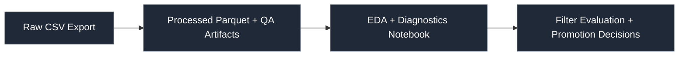

# oddsjam-ev-filters

A research framework for evaluating, stress-testing, and iterating on Positive EV betting filters using exported OddsJam Bet Tracker data.

This repository provides a **repeatable, script-driven analysis pipeline** designed to:

- Identify durable betting edges
- Eliminate negative-EV leakage
- Design exploratory **TEST filters**
- Promote validated TEST filters into a small, high-quality set of **PROD filters**
- Separate variance from true signal

Primary focus: **pre-match Positive EV betting only** (no live betting).

---

# Philosophy

This project treats sports betting as a research discipline — not reactive gambling.

Goals:

- Reduce overtrading and filter sprawl
- Converge toward ≤ 5 production filters
- Continuously explore new angles in a controlled way
- Make all filter changes evidence-driven
- Avoid emotional decision-making after variance swings

The system is designed so that new OddsJam exports can be dropped in and the entire research pipeline re-run consistently.

---

# High-Level Workflow



---

# Setup

Install dependencies:

```bash
poetry install
poetry run pre-commit install
```

---

## Data Workflow

### 1️⃣ Add Raw Export

Place your OddsJam Bet Tracker export CSV in:

```bash
data/raw/
```

---

### 2️⃣ Run Preprocessing

All preprocessing and QA now happens via a script:

```bash
poetry run python scripts/preprocess_bet_tracker.py
```

This script:

- Standardizes timestamps to ET  
- Applies optional date cutoffs  
- Normalizes filter names  
- Adds liquidity buckets  
- Adds time-to-event buckets  
- Computes EV-related fields  
- Generates QA artifacts  
- Writes processed parquet  
- Optionally writes a settled-only parquet  

Outputs are written to:

```bash
data/processed/
data/processed/artifacts/
```

---

### 3️⃣ Run EDA / Diagnostics

Open the main QA notebook:

```bash
notebooks/01_qa_initial_eda.ipynb
```

This notebook:

- Loads the processed parquet  
- Validates preprocessing assumptions  
- Reviews QA artifacts  
- Examines duplicates  
- Reviews liquidity coverage
- Produces initial EV & ROI diagnostics  

This notebook is your **data readiness sign-off** before deeper analysis.

---

## Repository Structure

```bash
src/oddsjam_ev/
    plotting/        # EV, ROI, filter-level and time-series visualizations
    metrics/         # EV math and odds utilities
    liquidity.py     # liquidity parsing and bucketing logic
    dedupe.py        # artifact dedupe utilities
    qa.py            # field validation + duplicate audits
    io/              # data loading + timestamp standardization

scripts/
    preprocess_bet_tracker.py  # YAML-driven preprocessing pipeline

configs/
    preprocess.yaml             # preprocessing configuration

notebooks/
    01_qa_initial_eda.ipynb     # validation + diagnostics

docs/
    RESEARCH_PLAN.md            # structured decision framework

data/raw/        # ignored by git
data/processed/  # ignored by git
figures/         # optional saved plots
```

---

## Preprocessing Design

The preprocessing pipeline is intentionally configurable via:

```bash
configs/preprocess.yaml
```

Key design principles:

- Clear separation between:
  - Processed dataset
  - Settled-only dataset
- Status settlement inferred via profit-known rates
- Liquidity buckets configurable
- Time-to-event bucketing configurable
- QA artifacts always written
- No dedupe by default (to preserve realized ROI integrity)

This ensures research reproducibility and auditability.

---

## Research Framework

The system operates as a closed loop:

### 1. Explore
Design new TEST filters to probe potential edges.

### 2. Evaluate
Measure:
- Theoretical EV
- Realized ROI
- CLV-based EV
- Variance behavior
- Liquidity sensitivity
- Time-to-event sensitivity
- Book-level exposure

### 3. Decide
For each filter:
- Promote to PROD
- Patch and retest
- Kill permanently

### 4. Iterate
Refine and tighten toward a small, durable production set.

---

## Plotting API

Reusable visualizations are exposed via:

```bash
src/oddsjam_ev/plotting/
```

Includes:

- Combined EV & ROI summaries
- Liquidity bucket diagnostics
- Faceted EV analysis
- Time-series performance
- Filter-level summaries

All plotting logic is centralized to ensure consistency across notebooks.

---

## Guardrails

- No reactive filter changes after short-term variance.
- No silent preprocessing changes — always YAML-driven.
- QA artifacts must be reviewed before performance conclusions.
- Duplicate analysis must precede modeling work.
- Liquidity missingness must be explicitly understood.

---

## Future Extensions

Potential roadmap:

- Opportunity-level deduplication modes
- Kelly sizing simulations
- Bankroll drawdown stress tests
- Monte Carlo variance simulations
- PROD vs TEST filter performance tracking dashboard
